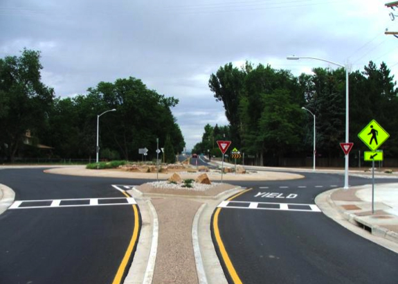
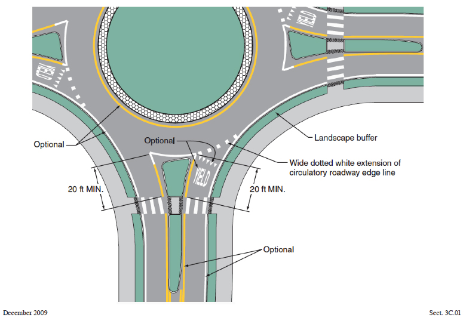
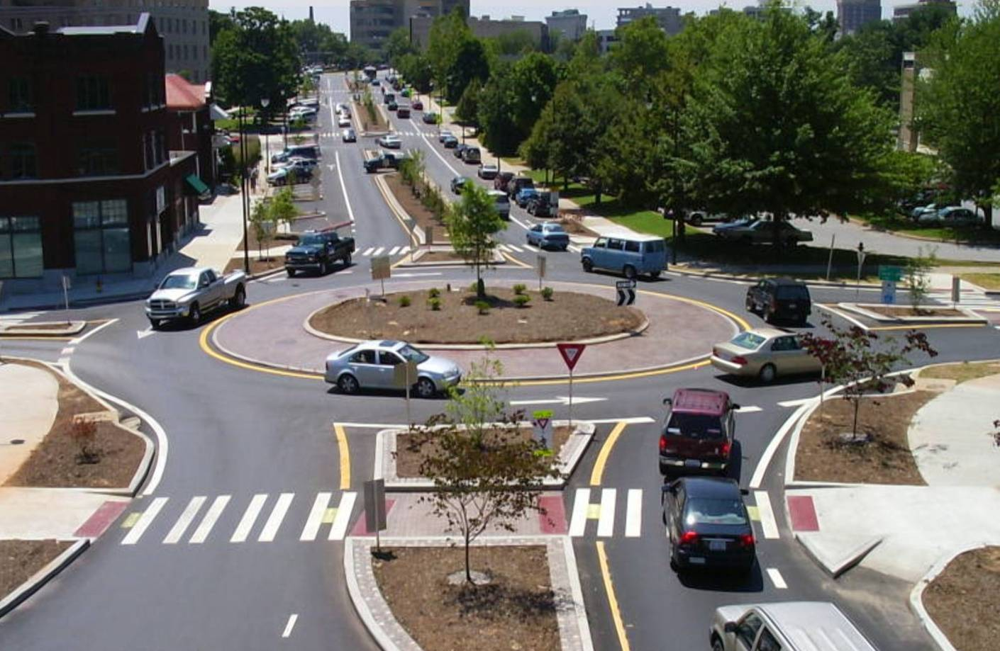

## DESIGN THINKING

**_Design an intersection where two perpendicular roads meet. Both roads have one lane of traffic traveling in opposite directions. The intersection must meet minimum federal and state safety standards for vehicular and pedestrian traffic._**

## DESIGNING THE INTERSECTION WITH ROUNDABOUT

---

Roundabouts are adaptable solutions that can work for most types of roads—from heavily-trafficked multi-lane roads to single-lane roads in urban downtowns—and implementing them in community road projects can go a long way to helping solve some of these challenges.

## Purpose

---

- Roundabouts are circular intersections designed to eliminate left turns by requiring traffic to exit to the right of the circle.
- Roundabouts are installed to reduce vehicular speeds, improve safety at intersections through eliminating angle collisions, help traffic flow more efficiently and reduce operation costs when converting from signalized intersections, and help create gateway treatments to signify the entrance of a special district or area.

## Consdirations

---

• When determining whether to install a roundabout, general considerations include pedestrian and bicycle volumes, effects on pedestrian route directness, the design vehicle, the number of travel lanes, and available rights-of-way.
• Yield lines should be provided at all entries of the roundabout.
• Where there are high pedestrian volumes, signal controls and larger crosswalk widths should be considered.
• Roundabouts often work best where the traffic flows are balanced on all approaches.

## Benefits

---

- **Reduced congestion**: Both multi-lane and single-lane roundabouts alleviate congestion by allowing continuous vehicle movement in lieu of traffic signals and a continuous flow for the traffic pattern.
- **Increased safety**: Roundabouts are proven to reduce the incidence of severe and fatal vehicle accidents due to their speed reduction and traffic calming properties, leading to a current trend of implementing “mini” roundabouts in pedestrian, multimodal urban areas across the country.
- **Cost savings**: Although research shows that the cost of implementing a roundabout is about the same as implementing a traffic signal in the same location, roundabouts are less costly over time to operate and maintain and do not require large capital outlays for major repair, allowing communities to make better informed asset management decisions.
- **Increased resiliency**: In times of crisis due to fire, flooding, or other climate-induced or non-climate induced situations, a non-signalized roundabout remains standing. There’s no power outage to deal with and no confusion and inconvenience related to traffic congestion delays.
- **Increased sustainability**: Roundabouts don’t stress the local power grid, often include green stormwater management features in their medians and reduce emissions from vehicles idling at traffic signals.

